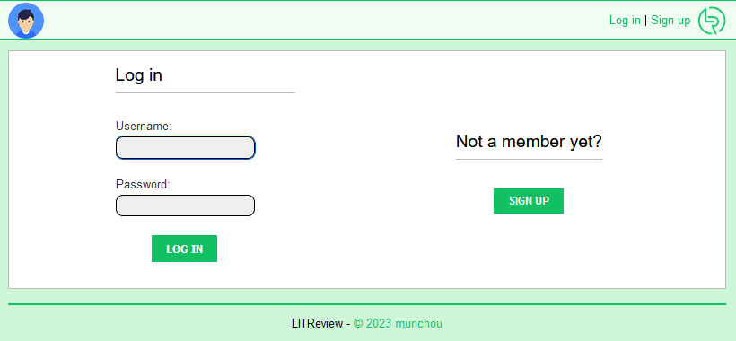
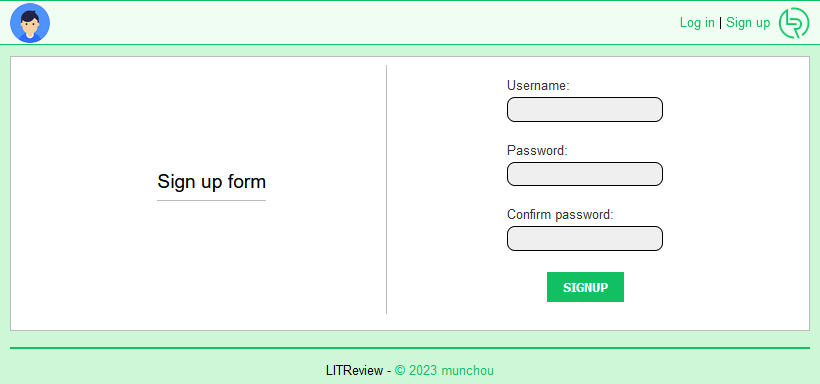
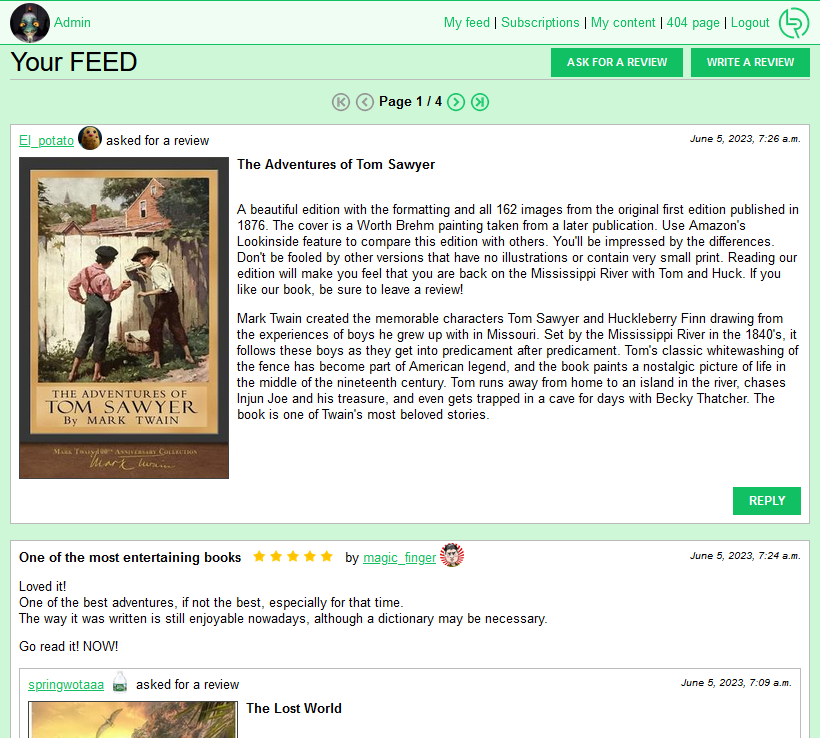
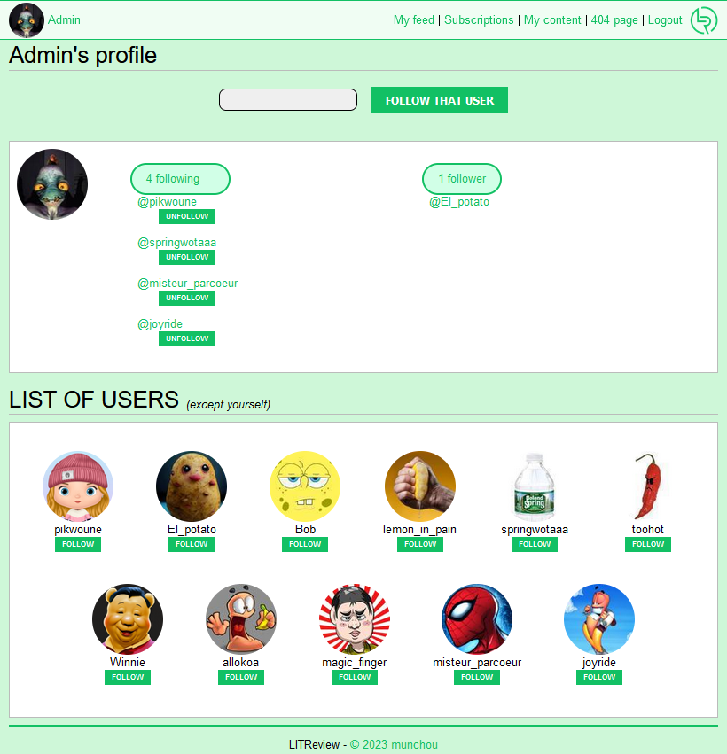
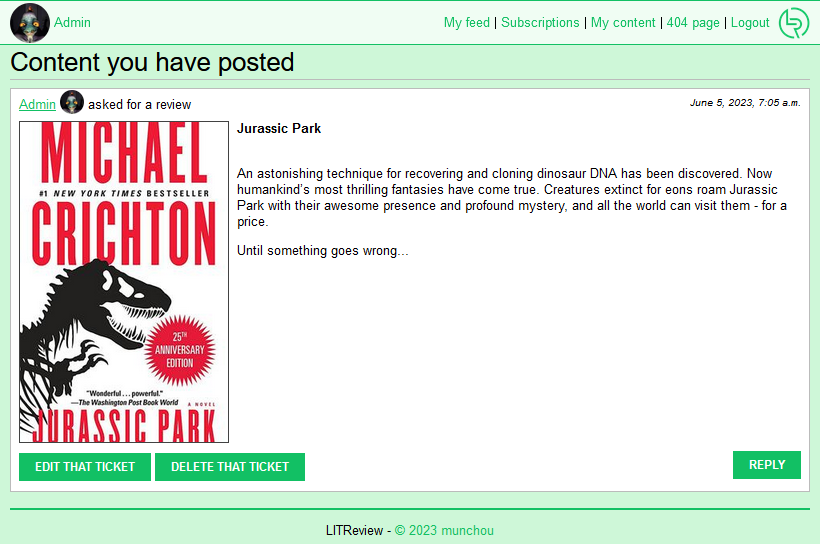
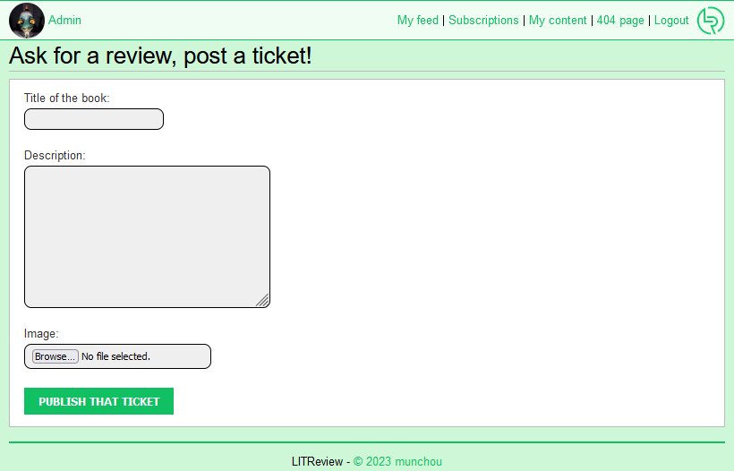
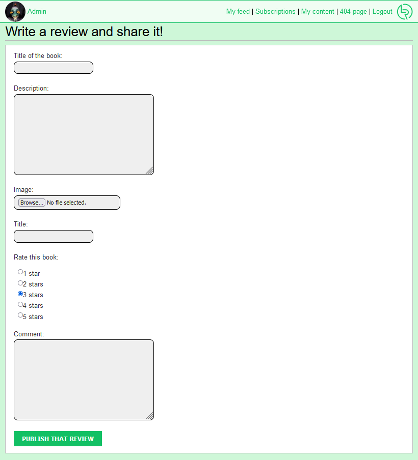
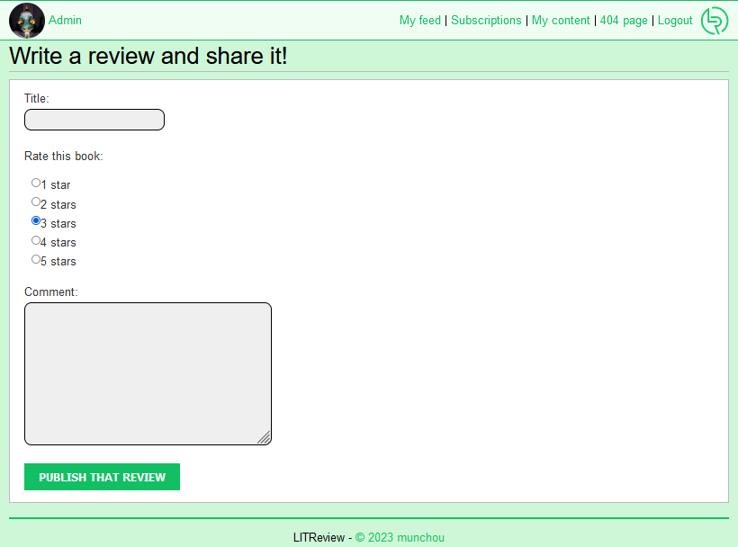

# A PROPOS

**OpenClassrooms - Développeur d'application Python - Projet #9: Développez une application Web en utilisant Django**

_Testé sous Windows 10 et Python 3.10.2_

# Comankonfè (Windows)
### Récupération d'une copie du "dépôt"

- `git clone https://github.com/munchou/OpenClassrooms-Project-9.git`

ou téléchargement du fichier ZIP puis extraction dans un dossier au choix.

### Création et activation de l'environnement virtuel
(Python doit avoir été installé)
- `cd OpenClassrooms-Project-9` (ou tout autre dossier où se trouve le projet)
- `python -m venv ENV` où ENV est le nom du dossier où sera créé l'environnement.
- Activation : `env/Scripts/activate`
    
### Installation des modules nécessaires

- `pip install -r requirements.txt`

### Pour lancer le programme
Il faut être dans le dossier où se trouve "manage.py" pour y lancer le serveur local.
- `python manage.py runserver`

### Pour accéder à l'application
Dans un navigateur, entrez une de ces 2 adresses:
http://127.0.0.1:8000/ ou http://localhost:8000/
Elles renvoient toutes les 2 à l'appli, mais les utiliser en même temps permet de se connecter avec deux comptes différentes (pratique pour tester user et admin côte à côte).

### Pour se connecter
Il y a un admin et 11 utilisateurs.

| *Identifiant*     | *Mot de passe* |
|-------------------|----------------|
| Admin             |     admin      |
| joyride           |    pass1234    |
| misteur_parcoeur  |    pass1234    |
| magic_finger      |    pass1234    |
| allokoa           |    pass1234    |
| Winnie            |    pass1234    |
| toohot            |    pass1234    |
| springwotaaa      |    pass1234    |
| lemon_in_pain     |    pass1234    |
| Bob               |    pass1234    |
| El_potato         |    pass1234    |
| pikwoune          |    pass1234    |

Page de connexion :

Page de création de compte :

Page d'accueil (feed de l'utilisateur), où sont affichés les créations dudit utilisateur et celles des autres utilisateurs qu'il suit. Les réponses à ses demandes de critique sont affichées, même si l'auteur de la réponse ne fait pas partie des utilisateurs suivis.

Page de souscriptions où l'utilisateur peut suivre et cesser de suivre d'autres utilisateurs. Le suivi peut se faire de deux manières différentes : en entrant précisément le nom de l'utilisateur cible puis en cliquant sur le bouton "FOLLOW THAT USER", ou simplement en cliquant sur le bouton "FOLLOW" sous l'image de l'utilisateur cible. A noter que la liste d'utilisateur n'affiche pas l'utilisateur connecté.

Section qui permet à l'utilisateur de voir ses contributions :

Page 404 personnalisée, exemple qui serait utilisé si l'appli était déployée live :

Page de création de ticket (= demande de critique). Tous les champs sont obligatoires :

Page de création de critique. Tous les champs sont obligatoires :

Page de création de critique en réponse à une demande. Tous les champs sont obligatoires :

