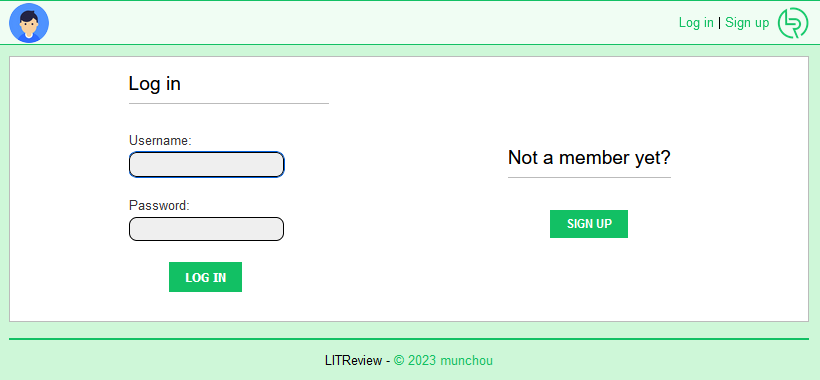
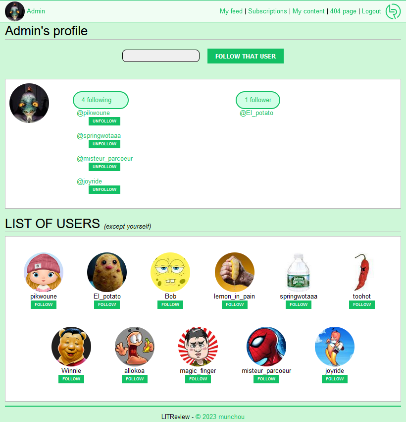
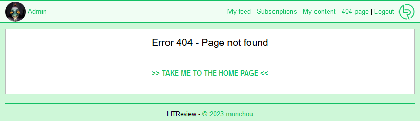
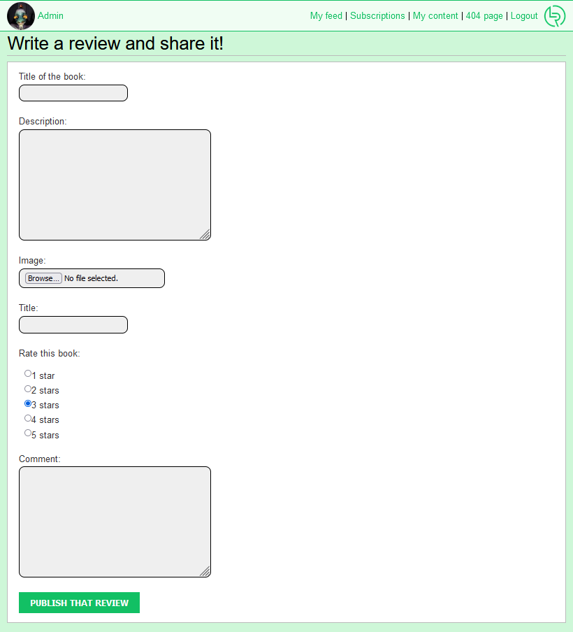
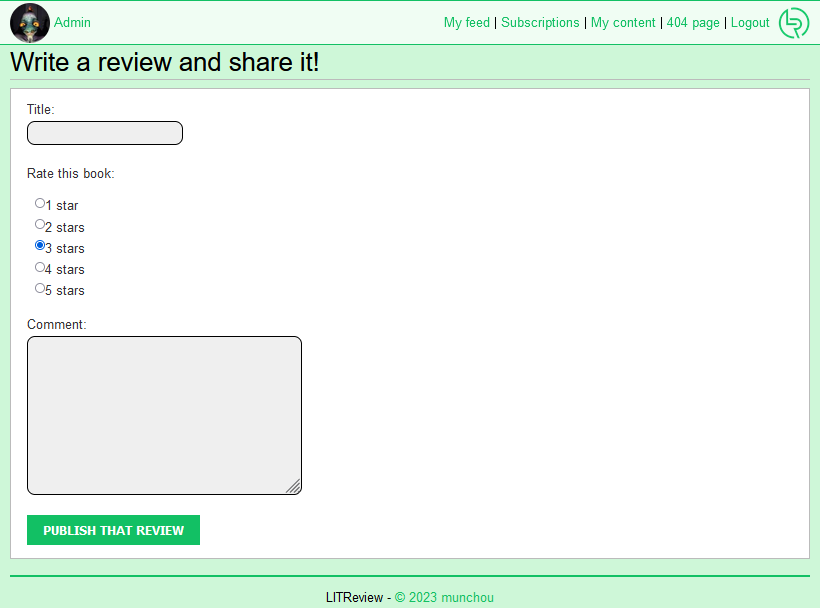

# ABOUT

**OpenClassrooms - Développeur d'application Python - Projet #9: Développez une application Web en utilisant Django**

_Tested with Windows 10 and Python 3.10.2_

# Hao2do (Windows)
### Retrieving a copy of the "depository"

- `git clone https://github.com/munchou/OpenClassrooms-Project-9.git`

or download the ZIP file and extract it in a chosen folder.

### Creating and activating the virtual environment
(Python must have been installed)
- `cd OpenClassrooms-Project-9` (or any folder where the project is located)
- `python -m venv ENV` where ENV is the name of the folder where the environment will be created.
- Activation : `env/Scripts/activate`
    
### Installing the needed modules

- `pip install -r requirements.txt`

### Starting the program
You must be located in the folder where "manage.py" is in order to start the local server.
- `python manage.py runserver`

### Getting to the application
In any browser, type either addresses:
http://127.0.0.1:8000/ or http://localhost:8000/
They both allow to access the appli, but using them at the same time allows to connect to two different accounts (useful to connect to a user and the admin at once).

### Connecting to an account
There is one admin and 11 users.

|       *ID*        |   *Password*   |
|-------------------|----------------|
| Admin             |     admin      |
| joyride           |    pass1234    |
| misteur_parcoeur  |    pass1234    |
| magic_finger      |    pass1234    |
| allokoa           |    pass1234    |
| Winnie            |    pass1234    |
| toohot            |    pass1234    |
| springwotaaa      |    pass1234    |
| lemon_in_pain     |    pass1234    |
| Bob               |    pass1234    |
| El_potato         |    pass1234    |
| pikwoune          |    pass1234    |

Connection page:

Account creation page:

Home page (user's feed), where the user's posts and the users' he follows are displayed. The replies to his review requests are displayed regardless of the fact that the author is being followed by the user or not.

Subscriptions page where the user can follow and stop following other users. Following can be done in two different ways: by precisely typing the target user in the text field and confirming with the "FOLLOW THAT USER" button, or simply by clicking the "FOLLOW" button located below the target user's ppicture. Note that the current user is not displayed in the list of users.

Page that displays the user's posted content:

Customized 404 Page serving as an example as what could be used if the app went live:

Creation of Ticket page (= asking for a review). All fields must be filled:

Creation of Review page (= asking for a critic). All fields must be filled:

Reply to a ticket page. All fields must be filled:

